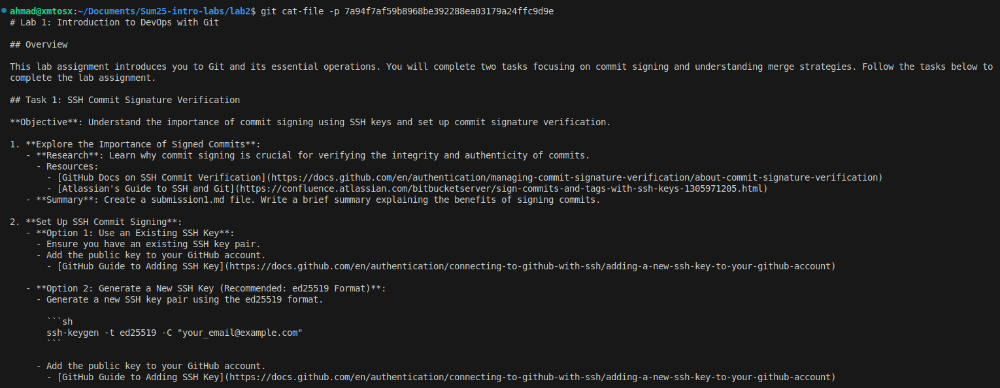
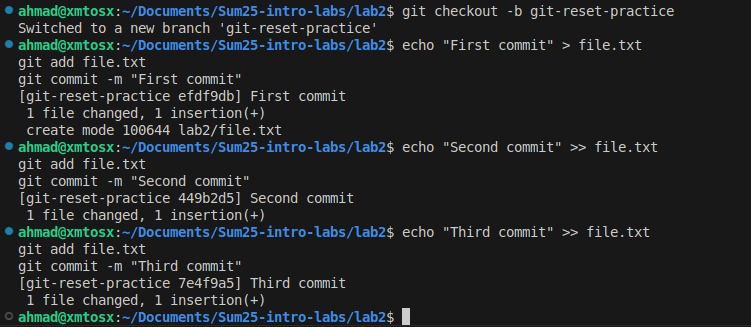
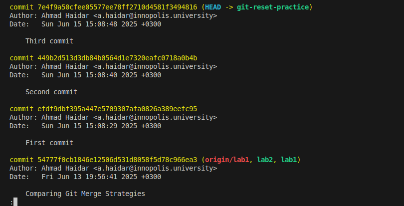
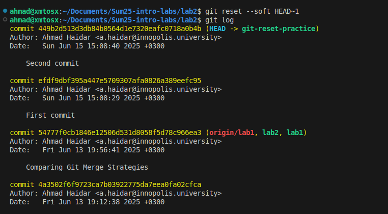
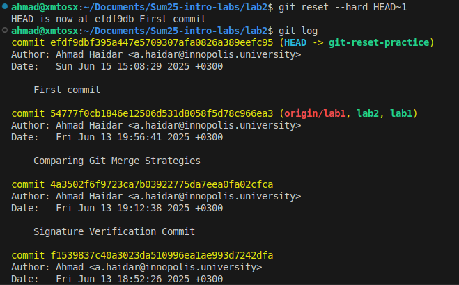
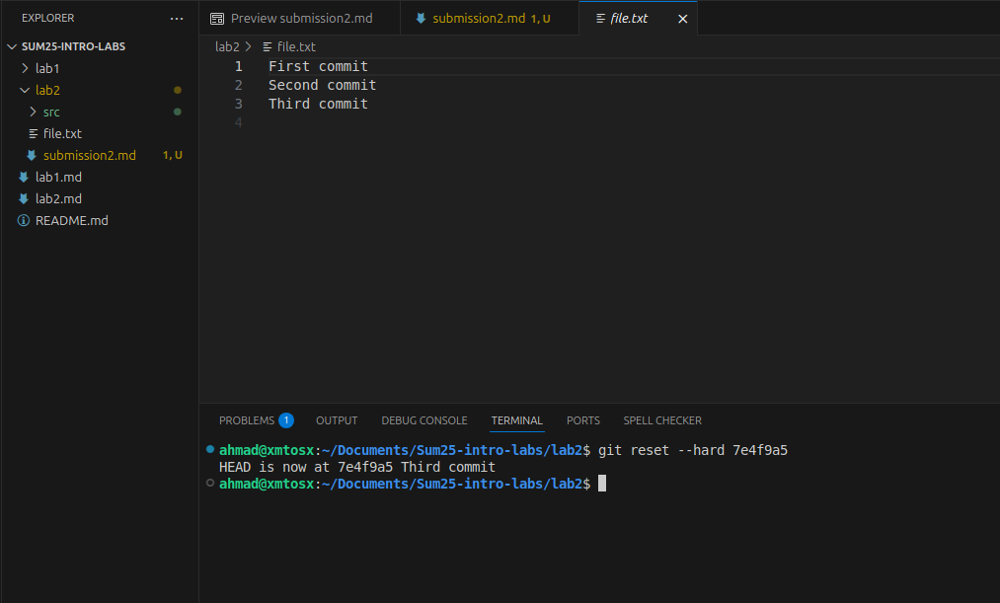
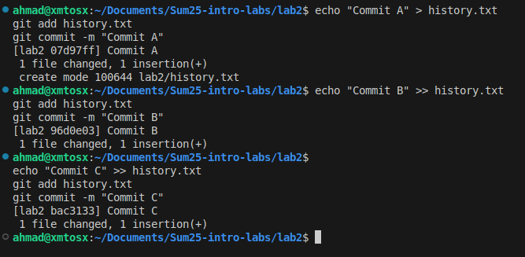

# Lab2: Understanding Version Control Systems

## Using `git cat-file`

* **Commit (`git cat-file -p <commit_hash>`):**
  
  

  A **commit** object represents a **snapshot** of the repository at a point in time.  
  It includes:
  * A reference to a tree object
  * Parent commits
  * Metadata like the author, timestamp, ...

  Commits are how git tracks changes and project history.

* **Tree (`git cat-file -p <tree_hash>`):**
  
  

  A **[tree](https://git-scm.com/book/en/v2/Git-Internals-Git-Objects)** object represents a **directory**.  
  It contains a list of entries, each with:
  * A filename
  * File mode/type  
  * The hash of a blob or another tree

  It maps the structure of the files in a directory at a particular commit.

* **Blob (`git cat-file -p <blob_hash>`):**
  
  

  A **blob** stores the actual contents of a file.  
  It does **not** contain the file name, permissions, or any metadata—only the file’s raw data. (Just like using `cat`)

## Git Reset

* **Creating a series of commits:**
  
  
  

* **Using `reset --soft`:**

  

  We notice that we went back to the previous commit and the changes that we made are still there but are not staged anymore.

* **Using `reset --hard`:**

  

  We notice that we went back to the previous commit but this time all changes made after this commit are deleted.

* **Using `git reflog` & recovering commits:**

  

  

  We went back to the the commit we specified and all the changes we made are back.

## Visualizing Commit History

Moving back to branch `lab2`:

* **Creating a series of commits:**
  
  

* **Visualizing Commits:**
  
  

  We see that 3 commits have been made in the brach that we are on `lab2`

* **Branching & Committing:**

  

* **Visualizing Changes:**

  

The graph from `git log --oneline --graph --all` shows where each branch starts and how commits flow. It clearly shows what was worked on, when, and on which branch—especially useful for multi-feature projects.

For example, in the graph we see the commits `"Commit A"`, `"Commit B"` and `"Commit C"` made on the `lab2` branch and then a new branch (`side-branch`) created from there, starting with `"Side branch commit"`.

## Tagging a Commit

* **tagging the latest commit on branch `lab2`:**

  
  
  

* **The associated commit hash:**

  

Tagging in git provides a clear and consistent way to mark specific points in a project's history, such as releases or milestones, making it easier to keep track of the versions of the app, collaboration, and integration with CI/CD pipelines.
